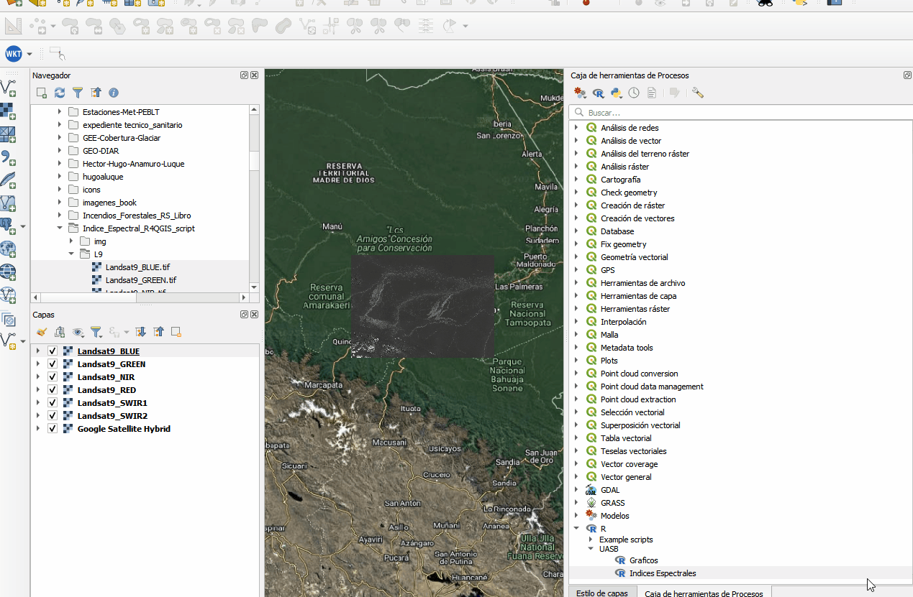

# **Script en R para calcular Índices Espectrales con imagenes Satelitales**

El script calcula los indices espectrales, NDVI, EVI, NDWI, SAVI, NBRI y NDSI de cualquier sensor que posea las bandas en el rango del espectro electromagnetico requerido para el calculo de cada índice.

  

 ## Índices Espectrales

### NDVI (Normalized Difference Vegetation Index)

El NDVI es uno de los índices de vegetación más utilizados. Mide la salud y densidad de la vegetación al comparar la reflectancia en el infrarrojo cercano (NIR) y el rojo (RED). Valores altos indican vegetación densa y saludable, mientras que valores bajos o negativos indican suelo desnudo, agua o nubes.

Fórmula

$$
NDVI = \frac{NIR - RED}{NIR + RED}
$$

Rango de Valores
-1 a 1 (valores > 0.2 suelen indicar vegetación).

### EVI (Enhanced Vegetation Index)

El EVI es una mejora del NDVI que corrige distorsiones atmosféricas y de suelo, especialmente en áreas con vegetación densa. Incorpora la banda azul (BLUE) para reducir influencias atmosféricas y parámetros de ajuste.

Fórmula

$$
EVI = G \times \frac{NIR - RED}{NIR + C1 \times RED - C2 \times BLUE + L}
$$

Donde:

(G = 2.5) (factor de ganancia),
(C1 = 6), (C2 = 7.5) (coeficientes atmosféricos),
(L = 1) (factor de ajuste de suelo).

Rango de Valores
-1 a 1 (similar al NDVI, pero más sensible en áreas densas).

### NDWI (Normalized Difference Water Index)

El NDWI se utiliza para detectar cuerpos de agua y monitorear su contenido de humedad. Destaca el agua al comparar la reflectancia en el verde (GREEN) y el infrarrojo cercano (NIR). Valores positivos indican agua, mientras que negativos indican vegetación o suelo.

Fórmula

$$
NDWI = \frac{GREEN - NIR}{GREEN + NIR}
$$

Rango de Valores
-1 a 1 (valores > 0 indican agua).

### SAVI (Soil-Adjusted Vegetation Index)

El SAVI ajusta el NDVI para minimizar la influencia del suelo en áreas con vegetación escasa. Introduce un factor de ajuste de suelo (L) para mejorar la precisión en regiones áridas o con cobertura vegetal baja.

Fórmula

$$
SAVI = \left( \frac{NIR - RED}{NIR + RED + L} \right) \times (1 + L)
$$

Donde:

(L = 0.5) (valor típico para vegetación intermedia; varía de 0 a 1).

Rango de Valores
-1.5 a 1.5 (ajustado para reducir ruido del suelo).

### NBRI (Normalized Burn Ratio Index)

El NBRI (también conocido como NBR) evalúa la severidad de quemas en áreas forestales. Compara el infrarrojo cercano (NIR) con el infrarrojo de onda corta 2 (SWIR2), ya que las áreas quemadas reflejan más en SWIR2 y menos en NIR.

Fórmula

$$
NBRI = \frac{NIR - SWIR2}{NIR + SWIR2}
$$

Rango de Valores
-1 a 1 (valores bajos indican áreas quemadas; pre-quema vs. post-quema para dNBR).

### NDSI (Normalized Difference Snow Index)

El NDSI detecta cobertura de nieve al comparar el verde (GREEN) y el infrarrojo de onda corta 1 (SWIR1). La nieve refleja alto en GREEN y bajo en SWIR1, lo que lo hace efectivo para mapear nieve y hielo.
Fórmula
$$
NDSI = \frac{GREEN - SWIR1}{GREEN + SWIR1}
$$

Rango de Valores
-1 a 1 (valores > 0.4 suelen indicar nieve).

## Cómo Usar el Script en QGIS

### Requisitos

- QGIS instalado con el [proveedor de procesamiento R activado](https://github.com/north-road/qgis-processing-r) (Processing Toolbox > R scripts).
- Paquete raster instalado en R.
- Bandas de entrada: BLUE, GREEN, RED, NIR, SWIR1, SWIR2 (de Landsat 5/8 o Sentinel-2, alineadas en extensión, resolución y proyección).

### Pasos para Usar el Script

#### Cargar el Script en QGIS:

Abre QGIS.

1. Ve a Processing Toolbox.
2. En la sección R, haz clic en "Create new script".
3. Copia y pega el contenido del archivo spectral_indices.rsx (proporcionado previamente).
4. Guarda como .rsx en la carpeta de scripts R de QGIS (generalmente C:\Users\hugoa\AppData\Roaming\QGIS\QGIS3\profiles\default\processing\rscripts).

 

#### Ejecutar el Script:

En Processing Toolbox, busca bajo "UASB" > el script con el nombre que se haya guardado.

Selecciona las bandas de entrada:

1. BLUE: Banda azul.
2. GREEN: Banda verde.
3. RED: Banda roja.
4. NIR: Banda infrarrojo cercano.
5. SWIR1: Banda SWIR1.
6. SWIR2: Banda SWIR2.

Especifica rutas de salida para cada índice (NDVI, EVI, etc.) como archivos raster (.tif).
Ejecuta el algoritmo.

#### **Consejos**

- Asegúrate de que las bandas estén en reflectancia de superficie (no DN).
- Si hay errores, verifica alineación de rasters o instala dependencias en R.